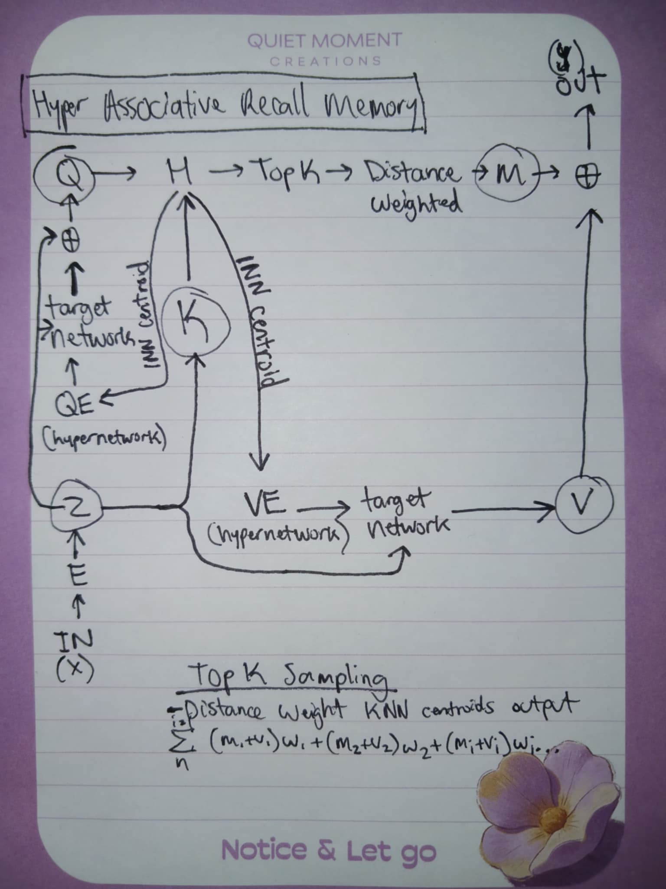

# Hyper ARM: Hyper Associative Recall Memory

# Part 3

## Backstory
Why can I not solve this problem?

I decided to finally give up, is what I think the answer is. You see, I never got to fully implement associative recall memory and witness its capabilities. I gave up. More accurately stated, I attempted an implementation, made a series of mistakes, got distracted, and chased them down a rabbit hole.

Let's focus on a couple more important questions before I press forward.

The sparse mixture of experts, non-naive bagging technique, whereby experts are weighted using a single scalar for fine tuning, how is that enabling compositional restructuring? Is knowledge being represented as contextual primitives that get weighted and recombined to produce meaningful signal? How is it that the disjoint experts generalize in the first place, before we even get to the fine-tuning phase?

It seems that naturally, with some deductive reasoning, one might ask some questions. For example: how is it the case that something which resembles naive "distance weighted prototypes" is doing the heavy lifting? Is that all associative recall memory is doing?

These are similar questions I asked while exploring the "HyperShot: Few-Shot Learning by Kernel HyperNetworks" paper. Now I know what you are thinking: "Whoa, does this have something to do with associative recall memory?" Yes. Yes it most certainly does.

I'm getting goosebumps simply while writing it. How was HyperShot doing few-shot, in-context learning, using what appeared to be "distance weighted prototypes"? Think about it. Their architecture learns a visual embedding for inputs. Not for prototypes, but for inputs with labels.

The embeddings are used to formulate a kernel that's fed into a hypernetwork, which then produces the weights of a target network. That target network weights the input embeddings against a query embedding via cosine similarity through a kernel that it consumes, and outputs class probabilities via their indices in the hypernetwork. Class probabilities via their indices? Sounds similar to how attention selects embeddings. Via indices.

Now something started to stand out here. They learn embeddings, and a Gram kernel matrix will produce proper scoring, but it's used instead as input to their target network. They utilize it for image classification. I speculated that it should generalize beyond image recognition. If there was one important detail my associative recall memory paper didn't include, it was this.

How does associative recall memory select class probabilities? You supplement inputs arbitrarily in the same manner as HyperShot. That's no coincidence. It may enable something strange, though this part is speculative: what if the memories came from another game mode, but everything else was identical? Zero-shot generalization for image:action tasks.

Their hypernetwork is conditioned on support images, and the query image can ask the question "which one of the images that I am conditioned on is the one associated with this query image?" The network outputs an index which reveals the answer.

Associated being the key word here. Rather than use pre-computed training datasets, what if the support set was retrieved via association from memory?

So I implemented something that one could say was "another accident". However, it wasn't. I derived it from first principles, similarly to how I ended up with an MoE in earlier papers. It was just part of the implementation process, which I got distracted by, improved greatly, and then noted its importance.

The MLP in the query encoder? That's produced by a HyperShot implementation. I doubt the system would work without it. It would have been reduced to the same issue as prior networks: learn the nuance of the entire data distribution in a single network. The KNN kernel? Part of the HyperShot implementation too. I only built the first half.

What is a HyperShot network but a latent Mixture of Experts? Well, maybe not in the strict HyperShot sense, but when I used the "binding affinity 1NN centroid trick," it absolutely behaves as such. The policy it produces is based on the embeddings of the indices provided to it. An outer KNN kernel between centroids and CNN-AE input is produced to determine binding affinity. The 1NN is provided to the hypernetwork as a "goal signal," which produces a subsequent network that consumes an inner KNN kernel between data points belonging to the centroids and the query input. This outputs weights for each index. The values for the corresponding indices are read by association between keys and values, which are retrieved via associations between query embedding and visual embedding. This produces the final weighting for the values, to produce actions as outputs. AKA Hyper ARM.

Where did I go wrong and need to go back to the drawing board? Nowhere. I laughed when I finally pulled myself out of my obsession with HyperShot implementations. It was producing results on its own, simply as a query encoder producing action outputs, that rivaled every single network I had ever produced. When a residual network was connected to this technique, it exceeded every score of every bot I had ever produced before. That was without the memory module of associative recall memory.

What was I observing here? How was a HyperShot query encoder producing better actions than an entire sparse mixture of experts? These results were yet again very startling, but I couldn't delete them. I had already pushed the code to branches and informed executives of the solution I was testing.

Then the answer stood out. I had coded a latent sparse mixture of experts. The solution was finally inevitable: associative recall memory + sparse mixture of experts. Maybe ARM blocks would never be necessary. ARM blocks? Think Multi-headed ARM, but I just called it naive bagging. Wouldn't the MoE, residing in the latent, save a massive amount of parameters while solving this task?

That question is the same exact reason why I am typing this story out today, and sharing it for the first time. By now, shouldn't I be more concerned with what could go right with this approach, rather than what could go wrong?

The solution seems to recur: replace a monolithic function approximator with a content addressable index over local space and a small learned function that decides weighting.

Content addressable memory is a phenomenon in neural networks and a primitive in databases, and most of deep learning's scaling problem is the cost of pretending otherwise.

What if, by conditioning the hypernetwork on a 1NN binding-affinity "goal signal," it enables the target network to learn subtle deviations of the same manifold? And its ability to "deviate manifolds" starts to compound. The compositional restructuring affects the manifold creation process, not the extraction or recombination of knowledge from the manifold.

## Proposal: Distilling Into Weights Instead of Probabilities
Here's something I haven't built yet, but I think it's the right next step.

Knowledge distillation usually works like this: feed input to a teacher, get a probability distribution, train a student to match it. Input in, probabilities out.

For MoE layers, I think that's the wrong target.

An MoE has a router and experts. The router uses binding affinity to decide which expert handles which input. So if a certain kind of input always gets routed to expert 5, then expert 5's weights became whatever they needed to be for that kind of input. The expert's weights are a consequence of the routing.

So the expert weights are kind of a function of the routing. What if you trained a hypernetwork to learn that function directly?

Take any open-weights MoE. Pull out the expert weights. Get the centroids the router uses. Train a hypernetwork where the input is a centroid and the target is the matching expert weights.

That's it. No training data. No probability distributions. Just centroid in, expert weights out.

It's still supervised learning. It's still distillation in a sense. But the input is binding affinity and the target is weights. Totally different setup.

I think this actually trains, because the targets are fixed. The thing that usually makes hypernetworks unstable is end-to-end training through a task loss. Here it's just regression with known answers.

And if it works, the compression is the obvious part. You don't store N experts anymore. You store one hypernetwork and N centroids. When you need an expert, the hypernetwork emits it. For MoE layers with hundreds or thousands of experts, that's where a lot of the parameter count in modern LLMs lives.

How do you check if it worked? Reconstruct the experts, plug them back in, run a benchmark, see how much worse it got. If the answer is "not much," the hypothesis holds.

This is cheap to test. You don't have to train an LLM. Just an open-weights MoE, some compute to fit a hypernetwork, and a benchmark. Someone with a GPU and a weekend could do it.

That's the proposal.

Okay, so in retrospect, maybe its naive to think centroid to hypernetwork weights could work. Maybe even thinking this approach would work without conventional knowledge distillation is naive in general. However, I think that even trying to find alternative solutions is a worthy puruit. 

Another simpler option seems possible to explore. Firstly, I think constraining the final layer weights of the networks produced by the hypernetwork, to be nearby each other, might enforce the manifold deviation hypothesis I proposed earlier. Traditional knowledge distillation with this in mind, might produce meaningful results on its own; without any additional tricks except this proposed auxilary loss.

I've got some sparse mixture of experts weights readily available. I do wonder what interpolation would be like between latent experts, or for top K latent experts. That might enable some interesting properties. Hmm.

### Original Diagram
